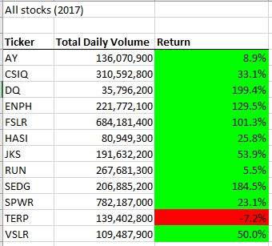
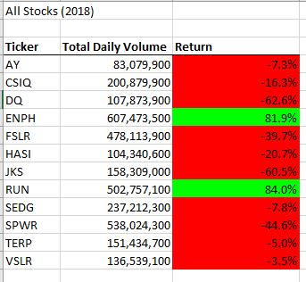
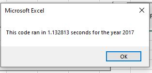
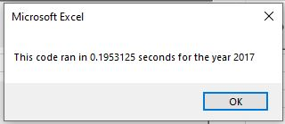
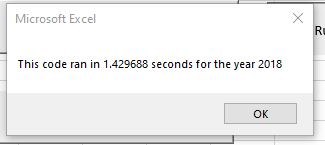
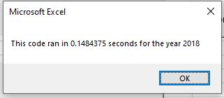

# Stocks_analysis
## Overview of Project
After  getting a positive feedback from Client Steve regarding the previous **Greenstock project**,however the Client wanted  the analyse large number of data sets which namely would include the entire stock over the last few years. The current state of code could only limit itself to few stocks. So this purpose of this project is to allow the cient to analyse any number of stocke performansce over any number of years with optimum performance ie. the result should not take much time to genrate and should be faster than the previous project. 

## Results
### Stock performance
Following  image 1.1 and image 1.2 display the stock performance for 2017 and 2018 respectively.
                          

         image 1.1                                         image 1.2

Although from first look it looks as though from year 2017 to 2018  Steve's portfolio didnt do well but when we caculate the average of both the years and see the overall gain or loss, We receive a gain of approx . 45 % !!!
Thanks to the portfolio gain of 2017 his overall loss was mitigated.
One feeedback which can be given is to remove TerraForm Power Operating, LLC (TERP) from the portfolio as biannually it has given a loss of about 12%.

Now coming to execution time of the original and refractored script, The following images show for both the script for original and refratored script respectively for year 2017

                                                     

              image 2.1                                 image2.2
              
Significant drop in the execution time by Approx 82%.

Execution time of the original and refractored script, The following images show for both the script for original and refratored script respectively for year 2018.

                                                     

              image 3.1                               image3.2            
Significant drop in the execution time by Approx 89 %.

## Summary
As mentioned above, advatntages of refract ored code  include  significant decrease in execution time and ability to modify the file more easily.
Disadvantage would be that the code writing would be signifcantly complex.
Advantages and disadvantages of the original and refactored VBA script as follows:
Advantages (refractored)
*   Significant decrease in execution time of the code by approximately 80%.
*   The code can include more tickers as steve adds more stocks to his porfolio

Disadvantages (refractored)
*  Complex code writing

Advantages (original)
* Easier to write
* Good to execute if Steves portfolio doesnt vary

Disadvantages (original)
* The code can automatically add the ticker's for analysis if Steves portfolio changes
